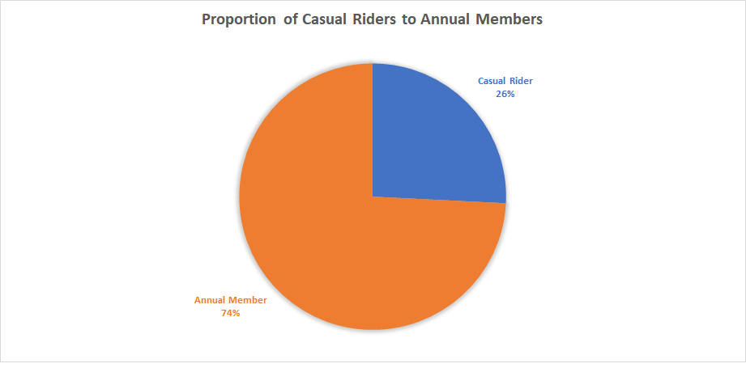

```{r setup, include=FALSE}
knitr::opts_chunk$set(warning = FALSE, message = FALSE)
```

## Introduction

I've been a data analyst since 2019, mostly analyzing research data and publishing [those projects I co-author](https://www.linkedin.com/in/babatunde-ademusire-37b23119a/details/publications/) in international journals. In October 2023, I decided to upskill and branch out to other fields where a data analyst is needed. The first step I took was to enroll in the Google Data Analytics Professional Certificate. This case study is a capstone project I completed as one of the requirements to obtain my certification.

In this case study, I analyzed [data owned by the City of Chicago Divvy bicycle sharing service](https://divvy-tripdata.s3.amazonaws.com/index.html), operated by Lyft Bikes and Scooters, LLC, and made publicly available by Motivate International Inc. 

### Problem Statement

The business task was to determine how annual members (riders who pay for an annual pass) differ from casual riders (riders who pay for a single-ride pass or a day pass) based on their bike usage. This would help provide insights into how to convert these casual riders into annual members. 

### Basis

Finance analysts working on this project had concluded that annual members are more profitable than casual riders, therefore stakeholders want to have more riders become annual members. Rather than targeting the entire population of Chicago, stakeholders want the marketing team to target casual riders in their campaign to have more annual members. They believe that with the right strategy, casual riders will be more likely to become annual members. But first, they want to know how this subset of their users differ from annual members. To mimic the Professor from the hit Netflix series, Money Heist, "this is where I come in".

## Data

### Data Description

The description of the data sources has been provided above. Specifically, the data analyzed in this project was from the first quarter of 2022. There were 503421 observations and 13 variables, including ride id, the type of bicycle used, when each trip started and ended, the station names, ids, longitudes, and latitudes where each trip started and ended, and the type of rider it was (casual rider or an annual member). Riders personally identifiable information was not included in the dataset, so it was impossible to compare casual riders with annual members using sociodemographic characteristics.

### Data Cleaning

The data was in three different CSV files, one for each month in the quarter, so my first intuition was to merge this data into one using Google Sheet, make a copy of the combined dataset, clean and transform it, before transferring to a SQL database management system or RStudio, where I would do further analysis.

However, due to the sheer size of the dataset, running basic tasks such as extracting data from a column and using same to autofill new columns using functions and formulas took several minutes. Thus, I decided to do use R for the data analysis from start to finish.

As a first step in my RStudio Cloud, I created a new folder in my working directory and imported the data files into it. I used this command to get the path to my working directory.

```{r get-working-directory}
getwd()
```

Then, I installed the tidyverse package, and loaded the tidyverse and knitr packages which were needed to complete the analysis.

```{r install-and-load-tidyverse}
install.packages("tidyverse", repos = "http://cran.us.r-project.org")
library(tidyverse)
library(knitr)
```

In order to merge different files into one in R, the column names should match. Therefore, I read each csv file and named the resulting data frame.

```{r read-csv-files}
jan_2022 <- read.csv('2022-divvy-tripdata/202201-divvy-tripdata.csv')
feb_2022 <- read.csv('2022-divvy-tripdata/202202-divvy-tripdata.csv')
mar_2022 <- read.csv('2022-divvy-tripdata/202203-divvy-tripdata.csv')

```

Subsequently, I verified that the column names are the same in each data frame

```{r confirm-column-names}
colnames(jan_2022)
colnames(feb_2022)
colnames(mar_2022)
```

Since they are, I removed these data frames in order to reduce the RAM used for this analysis and save resources.

```{r remove-unnecessary-data-frames}
rm(jan_2022, feb_2022, mar_2022)
```

I then merged the datasets into one.

```{r merge-datasets}
cyclistic <- list.files(path='2022-divvy-tripdata', full.names = TRUE) %>% 
  lapply(read_csv) %>% 
  bind_rows
```

I looked up the first 6 rows in the data frame - just to get a sense of what the data was like - using `head()` function and inspected the structure of the data using the `str` function.

```{r inspect-the-data}
head(cyclistic)
str(cyclistic)
```

The next thing I did was to check if there are columns with missing values. Six columns contained missing values, which I kept in mind, should I have to use data in these columns in subsequent steps of the analysis.

```{r check-for-missing-values}
cbind(
  lapply(
    lapply(cyclistic, is.na), sum
  )
)
```

These are the columns I am most interested in:

- `rideable_type`: the type of bicycle used for the trip
- `started_at`: the date and time the trip started
- `ended_at`: the date and time the trip ended
- `member_casual`: the type of rider it was, casual or an annual member.

At this point, it was imperative for me to confirm that there were no bad data in these columns.

How many types of bikes were there? Three distinct types were revealed by calling the `table` function. If there were trailing commas in the bike names, there would be one or more bike types seemingly repeated in the output of the function.

```{r list-bike-types}
table(cyclistic$rideable_type)
```

Intuitively, I knew the `started_at` and `ended_at` columns contained only the datetime data type values. If it were not so, the data type would have been character. More so, the time a trip ended should always be later than when it started. But this was not so, which implied bad data.

```{r filter-out-when-ended_at-is-earlier-than-started_at}
filter(cyclistic, ended_at < started_at)
```
Also, I found out that there were twenty-six cases where the trip started and ended at the same times. This is something I would like to clarify with the stakeholders the possible reasons why these might have occurred.

```{r filter-out-when-ended_at-equals-started_at}
filter(cyclistic, ended_at == started_at)
```

For now, I would only remove those instances of bad data where the time the trip ended was earlier than when it started.

```{r remove-rows-with-ended_at-less-than-started_at}
cyclistic_v02 <- filter(cyclistic, ended_at >= started_at)
```

After this, I confirmed that there were only two categories of riders.

```{r see-rider-types}
table(cyclistic_v02$member_casual)
```

And with this, dearest readers - mimicking Lady Whistledown in Bridgerton, another hit Netflix series - I have come to the end of the data cleaning process. Up next is data transformation.

### Data Transformation

Three key metrics I was interested in were:

- the duration of each trip, in minutes
- the day of the week each trip started
- the month each trip happened

Thus, I created three new columns for each and used a formula and a few functions to deduce or extract these from the `started_at` and `ended_at` columns.

```{r create-three-new-columns}
cyclistic_v02 <- cyclistic_v02 %>% 
  mutate(
    ride_length = seconds_to_period(ended_at - started_at), 
    day_of_week = wday(started_at, label = TRUE), 
    month_of_year = month(started_at, label = TRUE, abbr = TRUE), 
    .after = ended_at
  )
```

Also, I renamed the categories of riders in the `member_casual` column.

```{r rename-rider-types}
cyclistic_v02$member_casual[cyclistic_v02$member_casual == "casual"] <- "Casual Rider"
cyclistic_v02$member_casual[cyclistic_v02$member_casual == "member"] <- "Annual Member"
```

## Results and Discussion

### How many riders per group were there in the last quarter?

I generated a CSV file which contained data on the number of casual riders and annual members who made a trip using Divvy bikes in the last quarter. 

```{r generate-csv-on-number-of-riders-per-group}
write_csv(data.frame(
  table(cyclistic_v02$member_casual)
  ),
  file = "riders.csv")
```

I opened the CSV file in Excel which I used to create the pie chart below. I could have used the `pie` function in R to create something similar *but I must sha use Excel in this project*. Concretely, out of the 503419 trips that were made, 74% (373603) of them were by annual members.


### What was the average duration per trip for the different rider types?

I used the `aggregate` function to generate the summary statistics, which I then displayed in a tabular form. The mean duration per trip for casual riders in Q1 2022 was 31M 20S and that of annual members was 11M 49S. This makes sense. Let me use this analogy to explain why: If it were possible to do a day subscription on Netflix, you would probably spend more time watching movies that day than you would if you were on a monthly (or annual) subscription. Something about getting maximum value for your money.

```{r}
# Do descriptive statistics for each rider type
aggregate(ride_length ~ member_casual, data = cyclistic_v02, summary)
summary_stat <- data.frame(
  Rider = c("Casual Rider", "Annual Member"),
  Minimum = c("0S", "0S"),
  Median = c("12M 54S", "7M 46S"),
  Mean = c("31M 20S", "11M 49S"),
  Maximum = c("23d 20H 34M 4S", "1d 1H 59M 54S")
)

kable(summary_stat, caption = "Descriptive statistics for each rider type")
```

### How about the average trip duration on different days?

The table below showed the daily average trip duration grouped by the category of rider.

```{r table-on-avg_ride_duration_per_day}
avg_ride_duration_per_day <- aggregate(as.numeric(ride_length)/60 ~ member_casual + day_of_week, data = cyclistic_v02, mean)

avg_ride_duration_per_day <- rename(avg_ride_duration_per_day, 
       Rider = member_casual,
       `Day of Week` = day_of_week,
       `Mean (in minutes)` = `as.numeric(ride_length)/60`)

kable(avg_ride_duration_per_day, caption = "Daily average trip duration")
```

This is better visualized using the chart below:

```{r trip-duration-grouped-by-riders}
cyclistic_v02 %>% 
  group_by(member_casual, day_of_week) %>% 
  summarise(average_duration = mean(as.numeric(ride_length))/60) %>% 
  ggplot(aes(x = day_of_week, y = average_duration, fill = member_casual)) +
  geom_col(position = "stack") +
  labs(title = "Daily Average Trip Duration of City of Chicago Bikers",
       subtitle = "Casual Riders vs Annual Members",
       caption = "Data Source: Motivate Int'l Inc",
       fill = "Riders") +
  xlab("Day of the Week") +
  ylab("Minutes")
```

### What types of bicycles were used for the trips?

Casual riders used all types of bicycles, mostly electric bikes, closely followed by classic bikes, but also docked bikes. Annual members never used docked bikes. They embarked on a majority of their trips with the classic bicycles.

```{r bike-types}
cyclistic_v02 %>% 
  group_by(member_casual, rideable_type) %>% 
  summarise(number_of_rides = n()) %>% 
  ggplot(aes(x = rideable_type, y = number_of_rides, fill = member_casual)) +
  geom_col(position = "stack") +
  coord_flip() +
  scale_fill_manual(values = c("blue", "purple")) +
  theme_minimal() +
  labs(title = "Bicycle Used During Trips",
       subtitle = "Casual Riders vs Annual Members",
       caption = "Data Source: Motivate Int'l Inc",
       fill = "Riders") +
  xlab("Bicycle") +
  ylab("Count")
```

### How many rides were there per month?

The number of monthly rides was lowest in January (18520/85250), increasing steadily, with a two to four-fold increase from February (21416/94193) to March (89880/194160), across both rider groups (casual riders/annual members). 

```{r rides-per-month}
cyclistic_v02 %>% 
  group_by(member_casual, month_of_year) %>% 
  summarise(number_of_rides = n()) %>% 
  ggplot(aes(x = month_of_year, y = number_of_rides, fill = member_casual)) +
  geom_col(position = "dodge") +
  scale_fill_grey() +
  theme_minimal() +
  labs(title = "Monthly Number of Rides Among City of Chicago Bikers",
       subtitle = "Casual Riders vs Annual Members",
       caption = "Data Source: Motivate Int'l Inc",
       fill = "Riders") +
  xlab("Month") +
  ylab("Ride")
```

## Conclusions

Here is a recap of my key insights from this analysis:

- Bikers rode the longest on weekends, particularly Sundays, and the duration of trips generally declined from Mondays to Fridays.
- Casual riders typically cycled for a longer duration than annual members.
- Casual riders mostly used electric bikes whereas annual members mostly used classic bikes.
- Casual riders sometimes used docked bikes while annual members never did.
- There was a two-fold and a four-fold increase in the number of rides undertaken by annual members and casual riders from February to March 2022.

## Recommendations

- Marketing efforts should be most intensive during weekends.
- Campaigns should be focused on those riders who use classic and electric bikes.
- Factors or company policies that might have caused the high surge in the number of rides from February to March should be investigated and capitalized on to drive further growth.

## Limitations

The datasets did not include riders' personally identifiable information. As such, it cannot be determined if some casual riders kept coming back for more trips. Such riders are more likely to become annual members and could have been targeted in marketing campaigns.

More information is needed to understand why some riders (26) ended their trips at the same time they started them. Were they dissatisfied with Lyft Bikes and Scooters offering? Did they pay for the trip but had to leave due to an emergency? Whatever their reasons may be, they are unlikely to influence the analysis done in this project significantly as their number was small and almost equally distributed between both rider groups (11 casual riders to 15 annual members).

## Final Remarks

Thank you for reading this far. What do you like about this case study? What do you agree or disagree with? Please leave suggestions, questions, corrections or clarifications in the comments.

Oh! I'd definitely be doing more case studies. Please follow me so you don't miss out on the next one.

I am open to data analyst roles. Please [refer me](https://www.linkedin.com/in/babatunde-ademusire-37b23119a/) or [reach out to me](mailto:babatundeademusire@gmail.com) if you're hiring. Thank you.